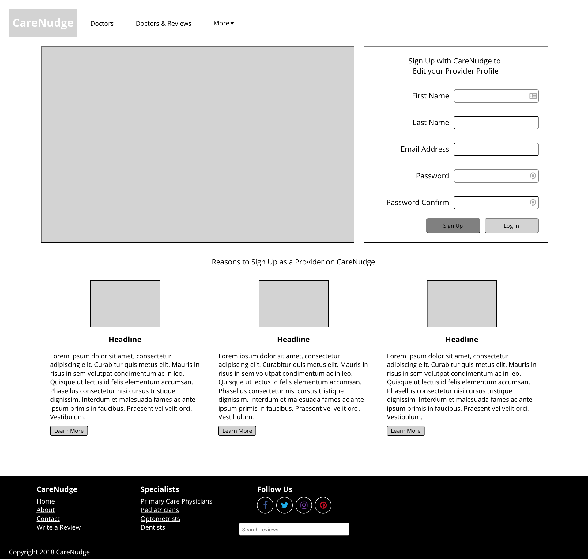

# CareDash Code Challenge

This solution contains a Rails server API and an Angular single-page application under ```./webapp```



### Setup

#### Installed prerequisites
```gem install bundler```

And a PostgreSQL database, check the ```./config/database.yml``` file for configuration

##### Build rails
```bundler install```

```rake db:create```

```rake db:migrate```

##### Build angular
```cd ./webapp```

```npm install```

```ng serve```


##### May help: 
```npm install -g @angular/cli```


## Run rails & angular-cli development server

```rails server```

```cd ./webapp```

```ng serve```

### Considerations
1) Primary focus was to write DRY code using directive components
2) Doctor and Review services maintain state but are not Observables (too much for such a small app)
3) Page is fully responsive with a collapsible navigation menu
4) Navigation can be configured in the navigation component, this supports single items and dropdowns
5) Navigation header and footer are full width across all screens
6) Main content section has variable margins on larger screens
7) Main content background set to white while the footer is black, design preference 
8) Functional 'review' content search in the footer
9) Front-end doesn't support updating data just yet
10) Calls from the front-end are pessimistic  
11) ```/doctors/reviews``` API route is in no way scalable
12) Server-side pagination would be nice
13) In regards to the given wireframe... Comic Sans, really?!
14) For luck